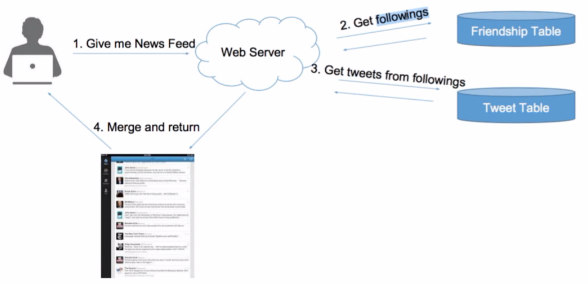
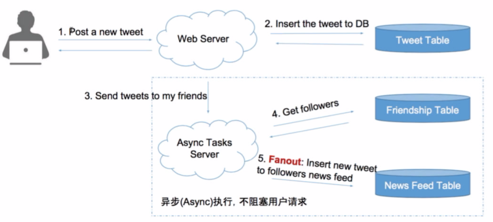

# Introduction
1. 直接让你设计一个推特。
2. Trouble shooting. 网站崩了怎么办，网站加载太慢怎么办。

## Standard
1. 可行解 Work Solution 25%
2. 特定问题 Special Case 20%
3. 分析能力 Analysis 25%
4. 权衡 Tradeoff 15%
5. 知识储备 Knowledge Base 15%

## 分析
1. Scenario. 
    - System features.
    - Queries per second (QPS).
    - Daily Active User (DAU). 一日内登录或者使用了某个产品的用户数（去除重复）。
    - Interfaces.
2. Service. 讲大功能进行分类。将大系统拆分为小服务。
3. **Storage(最重要).** 存储：数据如何存储与访问。
    - Schema.
    - Data structure.
    - SQL 用户信息 User Table
    - NoSQL 社交图谱Social Graph (followers), 推文
    - FileSystem 图片视频
    - Redis/Memcached.
    - Object-Oriented Design.
4. Scale. 升级：解决缺陷，处理可能遇到的问题。
    - Sharding.
    - Optimize.
    - Special Case.

## QPS
- QPS = 1k. 用一台好点的web服务器。考虑Single Point Failure.
- QPS = 1M. 建设一个1000台Web服务器的集群。需要考虑如何Maintainance(某一台挂了怎么办).

**数据库QPS性能**
| MySQL | MongoDB | Redis / Memcached  |
|-------|---------|--------------------|
|  1k   |   10k   |   100K ~ 1000K     |

## 新鲜事系统 News Feed
- 你登录朋友圈之后看到的信息流
- RSS Reader 简单讯息聚合订阅（Really Simple Syndication feed）

**新鲜事系统的核心因素**：
- 关注与被关注
- 每个人看到的新鲜事是不同的

### Pull Model
用户查看订阅信息的时候。
从订阅的公众号中提取文章，再按时间顺序排列。

算法：Merge K sorted Arrays

时间复杂度：假设有N个关注的对象，则为**N次DB Reads的时间** + K路归并时间（可忽略）

为什么K路归并的时间可以忽略，因为读数据库花很多时间。

这种pull model的**缺陷**是什么？
- N次DB Reads的时间非常慢！

我们看Push Model.

### Push Model
**算法**
1. 为每个用户建一个List存储他的News Feed信息
2. 用户发一个Tweet之后，将该推文逐个推送到每个用户的News Feed List中。
    - 关键词：Fanout
3. 用户需要查看News Feed时，只需要从该News Feed List中读取前100条即可

**复杂度分析**
- News Feed => 1次DB Read
- Post a tweet => N个分析，需要进行N次DB Writes
    - 好处就是可以用异步任务在后台执行，无需用户等待。

**缺陷：**
- 如果followers多，比如一千万，那么就会很慢，消息更新不及时。可以多加几台机器来进行异步任务。
- 如果有很多僵尸粉。。。

## Scale扩展

比如说，根据粉丝数量来采取不同策略。
- 粉丝多我就用pull.
- 粉丝少，我就用push.

