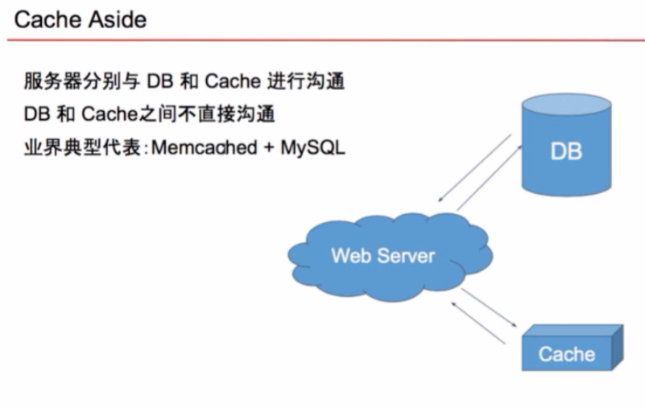
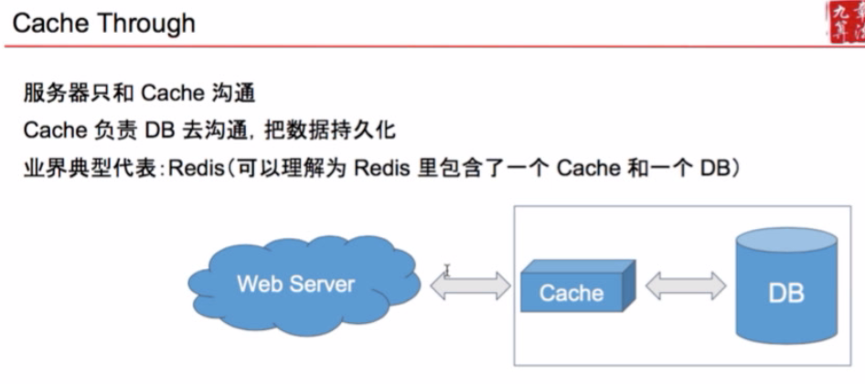

# User System

## Scenario
- 注册、登录、查询、用户信息修改
   
    哪个需求量更大 --- 查询。打开微信，就是对自己的用户信息进行了一次查询。
- 100M DAU. 这意味着什么？我们要确保查询的峰值的时候，算算峰值QPS, 数据库不会爆掉。
    - 100M * 100 / (24 * 60 * 60) 约等于 100 K
    - 100就是平均每个用户，每天，查询用户信息相关的操作次数（查看好友，发信息，更新主页）
    - 峰值就估算为 100 K * 3 = 300 K

### 数据库QPS性能
| MySQL | MongoDB | Redis / Memcached  |
|-------|---------|--------------------|
|  1k   |   10k   |   100K ~ 1000K     |

## Service
- AuthService 注册登录
- UserService 用户信息存储与查询
- FriendshipService 好友关系

## Storage 
- Cache
    - Memcached 不支持数据持久化
    - Redis 支持数据持久化

- LRU Cache: Least Recently Used Cache
- LFU Cache: Least Frequently Used Cache

**另见LFU专题和LRU专题。**


## 抛砖引玉：Memcached如何优化DB的查询



```python
class UserService:

    def getUser(self, user_id):
        key = "user::%s" % user_id
        user = cache.get(key)
        if user: 
            return user
        user = database.get(user_id)
        cache.set(key, user)
        return user
    
    def setUser(self, user):
        key = "user::%s" % user.id
        cache.delete(key)
        database.set(user)

```

看看下面的setUser方式。
1. database.set(user); cache.set(key, user). 还有，如果前半步成功了，但是cache set失败了，下次读数据就是脏数据了。
2. cache.set(key, user); database.set(user). 如果前半步成功了，后半步失败了。
3. **cache.delete(key); database.set(user)**. 这是代码里面的写法。这个出错的概率很低。只有在高并发的时候，一个线程先从database读了user，这时候另一个线程setUser，然后这时候切回第一个线程,这个线程把cache改成脏数据了。
4. database.set(user); cache.delete(key). 如果改完database的一瞬间有人去访问cache，就不一致了。

**cache可以加一个过期时间，这个方法叫 Eventually consistency.因为无论怎么写这个逻辑，在高并发的情况下，没有办法根除cache与database数据不一致的问题。**


## Authentication Service

用户是如何实现登录与保持登录的？
- 会话表 Session 
    1. 用户Login后，创建一个Session对象。
    2. 并把session_key作为cookie值返回给浏览器。
    3. 浏览器将该值记录在浏览器的cookie中。
    4. 用户每次想服务器发送的请求，都会自动带上该网站所有的cookie.
    5. 词是服务器检测到cookie中的session_key是有效的，就认为用户登录了。
    6. 用户Logout后，从session table里面删除对应数据。


    | Field       | Format      | Description     |
    |-------------|-------------|-----------------|
    | Session_key | string      | globally unique |
    | user_id     | Foreign key |                 |
    | expire_at   | timestamp   |                 |

- Session Table存在哪里？
    - 缓存 + 数据库
    - 小网站可以只存缓存
    - 如果是个大网站，有很多用户，只存缓存会有什么问题？如果缓存服务器崩掉了，那接下来就会迎来一个登录高峰。

## Cache and Database




## Friendship Service

- 单向好友关系(Twitter, Instagram, Weibo)： Friendship Table记录每条有向边即可。

| Field        | Format      | Description |
|--------------|-------------|-------------|
|from _user_id | Foreign key | 用户主体     |
|to_user_id    | Foreign key | 被关注的人   |

- 双向好友关系(WhatsApp, Facebook, WeChat)
    - 方案1：存两条信息，A关注了B，B也关注了A.
    - 方案2：存一条信息，但查询的时候需要查两次。用户1和用户2，按有序存，查的时候，直接查小的用户1的好友是不是有用户2. 

| Field        | Format      |
|--------------|-------------|
|small_id      | Foreign key | 
|big_id        | Foreign key | 

| small_id | big_id |
|----------|--------|
| 1        |   2    |
| 1        |   3    |
| 2        |   3    |

这个表的意思是，1的好友有2和3，2的好友有3.

- 涉及的操作
    - 取得某个user的所有关注对象
    - 取得某个user的所有粉丝
    - A关注B -> 插入一条数据
    - A取关B -> 删除一条数据


## 数据库选择原则

1. 大部分情况NoSQL和SQL都可以。
2. 需要Transaction就必须要用SQL.
3. SQL更加成熟，帮你做了很多事情；NoSQL很多事情需要亲力亲为，例如Serialization, Secondary Index.


## Sharding and Replica

- 数据拆分 Sharding：按照一定的规则，将数据拆分成不同的部分，保存在不同的机器上。
- 数据备份 Replica: 通常的做法是一式三份，还能分摊查询请求。

## Sharding in SQL vs NoSQL

- SQL自身不带Sharding, 需要码农亲自上手。
- Cassandra为例的NoSQL大多数都自呆Sharding.

## Vertical Sharding
- User Table, Friendship Table, Message Table分别放在三个数据库
- 更高级点的做法：同一个表也可以拆分，跟登录有关的可以放在一个服务器，使用频率高的可以放在一个服务器。
- 缺点：如果某一张表特别大，怎么办？就要用横向拆分。

## Horizontal Sharding
如果一张数据表特别大。
- 一个粗暴的想法：from_user_id % 10. 但问题就是10台机器还是不够用，从10变成11的时候，会有大规模的数据迁移，服务器压力大，容易挂，容易造成数据的不一致。怎么办呢？**用一致性哈希算法Consistent Hashing**。后面章节会详细讲。


