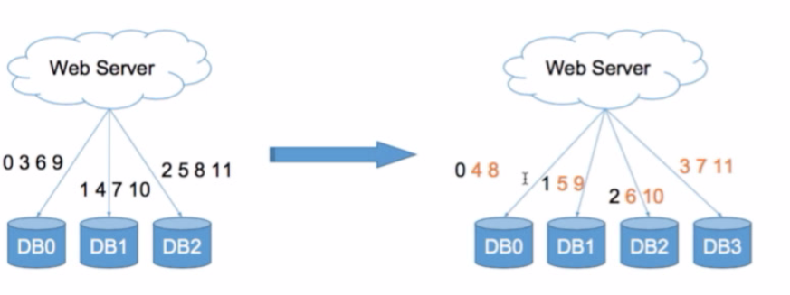
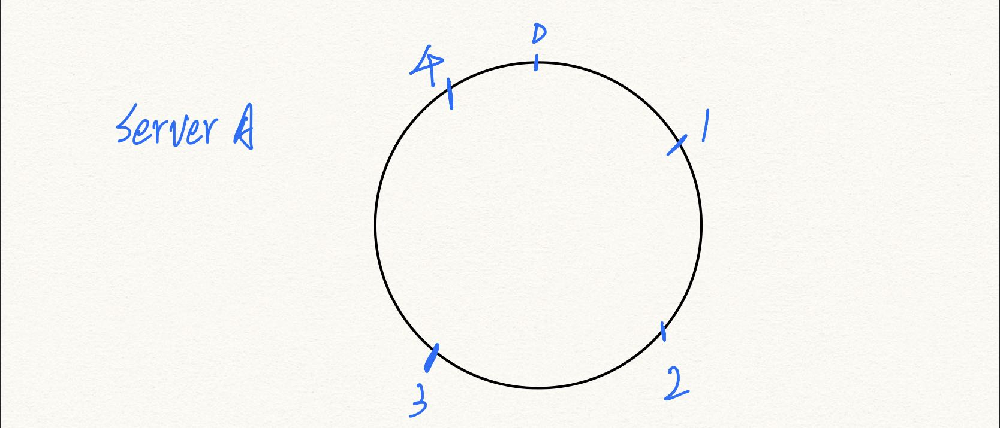
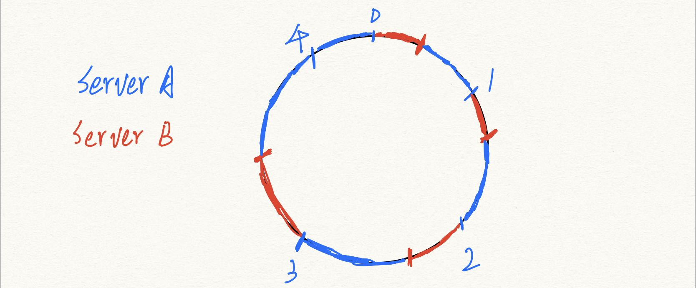

# Consistent Hashing

% n可以说是一种简单的Hash算法，但是n变成n+1的时候，key % n 和 key % (n+1)的结果基本上都不一样，所以这个算法可以成为不一致hash.

怎么办呢？**我们把key模一个很大的数，比如360**.
那如果n从2变为3，那就只有三分之一的数据移动。

还可以怎么做？可以找一对相邻区间的机器，现在我插入DB3，我就从DB1和DB2之间插入，DB1和DB2都把自己三分之一的数据分给DB3.
- 缺点：导致区间不连续了，迁移压力也是挺大的。

**实际上怎么做呢**？怎么样规避区间不连续的问题，怎么避免大量数据迁移的问题？

1. 我们先构建一个环，这个环由0 ~ 2^64-1这么多个点组成。
2. 一开始只有一台服务器A，服务器随机在这个环上面撒5个点，如图（实际上可能撒1000个点），使得点在环上的分布尽可能均匀。对每个key都求一个hash值例如，我求得的hash值在0到1之间，那我顺时针找到1，然后这个1是服务器A管的，所以这个数据就会存在服务器A.

3. 现在我们扩充一台服务器B, 我们继续疯狂撒点，可能还是撒1000个点，红色部分，就是服务器B负责的部分。数据迁移的时候，就找顺时针的下一个点要数据即可。

刚刚撒点，我是需要记录这些点的位置的，我给出一个数，需要找到恰好比这个数大的这个点，那我们用什么数据结构呢？用**TreeMap,实际上是红黑树**.

